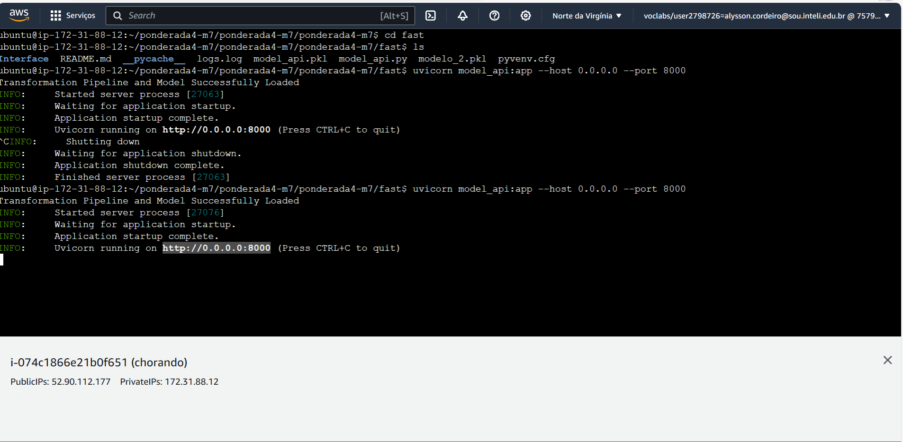
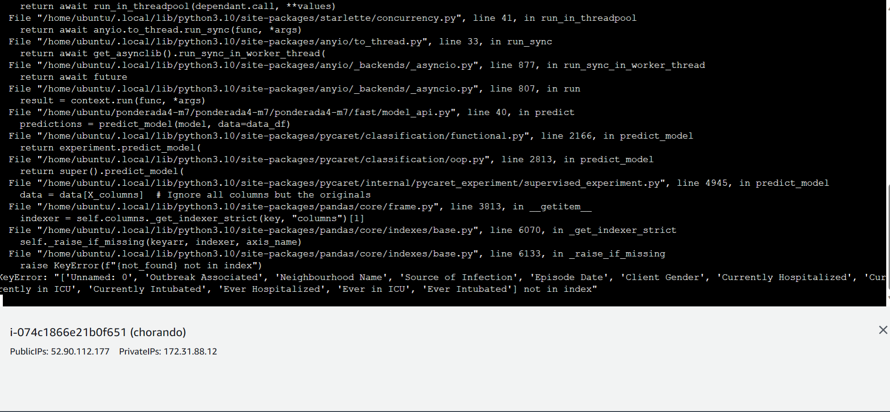
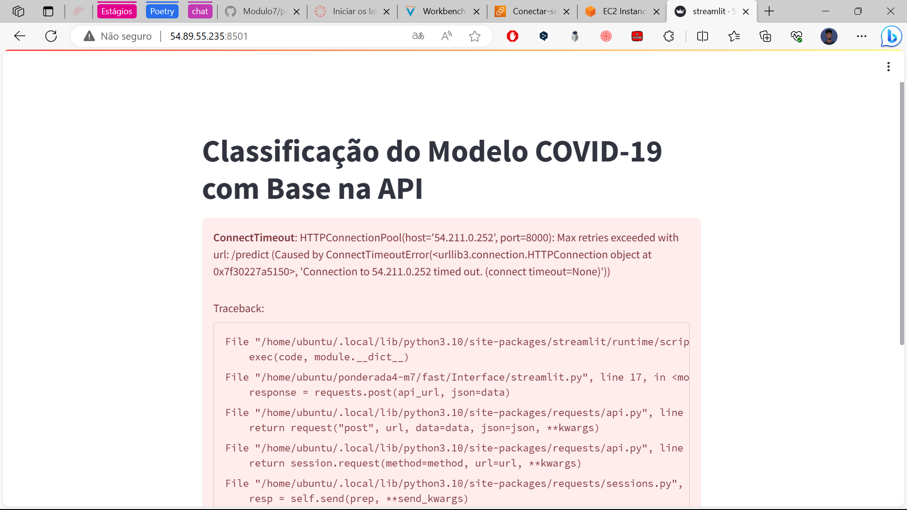
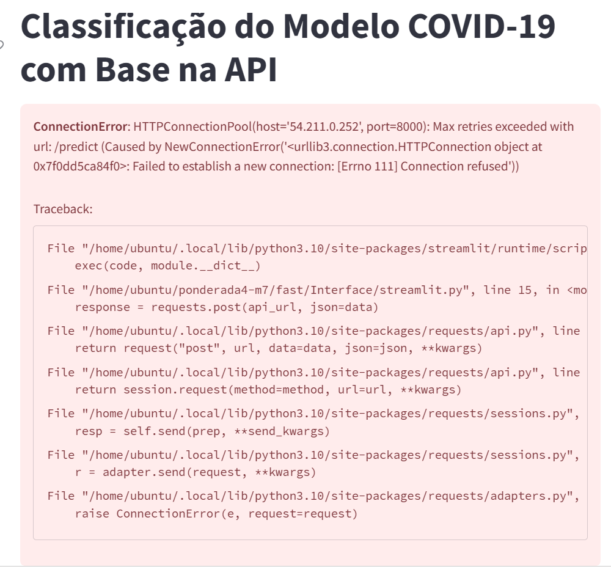

# Ponderada4 - M7 Construção de Dashboard para Visualização de Dados

**Autor:** Alysson Cordeiro

## Descrição

Este projeto consiste em um dashboard desenvolvido em Streamlit para visualização de dados de predição de COVID-19 na cidade de Toronto. Ele exibe informações sobre casos confirmados (1) e não confirmados (0) e inclui autenticação por meio de login.

## Desenvolvimento

### Colab

- Responsável por gerar o API do modelo, usando a função do Pycaret `create_api()`.
- [Link do Colab](https://colab.research.google.com/drive/1fGh0QMEHhlC0hivOub03WCWFFvTzTu_7?usp=sharing)

### Backend

- Desenvolvido em Python e utilizando o framework FastApi.
- O seu propósito é receber as solicitações de previsão e, em seguida, responder a elas com base no modelo criado na fase anterior.

### Frontend

- Desenvolvido em Python e utilizando o framework Stremlit.
- Página de predição: neste local, o usuário pode inserir os dados para efetuar uma previsão.

### AWS

O projeto foi executado na nuvem utilizando o serviço EC2 da AWS. Foi usado o terminal Ubuntu.

## Instalação

Crie um EC2 na AWS usando Ubuntu e instale os comandos base para o projeto:

```bash
sudo apt update
sudo apt upgrade
sudo apt install python3 python3-pip -y
```
Instale o Docker também:
```bash
sudo apt-get update
sudo apt-get install ca-certificates curl gnupg
sudo install -m 0755 -d /etc/apt/keyrings
curl -fsSL https://download.docker.com/linux/ubuntu/gpg | sudo gpg --dearmor -o /etc/apt/keyrings/docker.gpg
sudo chmod a+r /etc/apt/keyrings/docker.gpg
```

```python
echo \
  "deb [arch="$(dpkg --print-architecture)" signed-by=/etc/apt/keyrings/docker.gpg] https://download.docker.com/linux/ubuntu \
  "$(. /etc/os-release && echo "$VERSION_CODENAME")" stable" | \
  sudo tee /etc/apt/sources.list.d/docker.list > /dev/null

sudo apt-get update
sudo apt-get install docker-ce docker-ce-cli containerd.io docker-buildx-plugin docker-compose-plugin

```

Após finalizar a instalação, clone o repositório que está no Github:

```python
git clone https://github.com/alyssoncastro/ponderada4-m7.git
```

Não esqueça de  instalar as dependências:

```python
pip install fastapi
pip install pycaret
pip install uvicorn
pip install pandas
pip install numpy
pip install pydantic
pip install streamlit
```

## Pontos de Erro no Projeto
1. Problemas de Gerenciamento de Pacotes e Dependências: O projeto enfrentou dificuldades no gerenciamento de pacotes e dependências, o que resultou em problemas na execução do projeto localmente. Isso pode ocorrer devido a conflitos de versões ou configurações de ambiente inadequadas.

2. Erro na API: O projeto apresentou erros na API, o que impediu sua execução adequada. É importante identificar e solucionar esses erros para garantir o funcionamento correto da API.

3. Dashboard não Renderiza o Gráfico: O dashboard não conseguiu renderizar o gráfico devido à dependência da API. Isso indica uma forte dependência entre os componentes do projeto e ressalta a importância de garantir que todas as partes funcionem de forma integrada.

4. Execução do Projeto Localmente: O projeto não foi configurado para ser executado localmente, o que dificultou o teste e desenvolvimento em um ambiente de desenvolvimento pessoal. É importante considerar a portabilidade e facilidade de uso do projeto.

Para resolver esses problemas, é recomendável revisar a configuração das dependências, identificar e corrigir os erros na API e garantir que o dashboard funcione corretamente mesmo na ausência da API (por exemplo, utilizando dados de exemplo). Além disso, documentar os requisitos de configuração e soluções para possíveis problemas ajudará a facilitar o desenvolvimento e a implantação futuros.

No README mostra os vídeos. Para Api foi testado erros:





.png)

Já no Streamlit o erro é gerado pela falta de API, então não rederiza o gráfico. Veja o código (linha 11 do arquivo ```streamlit.py```) e em seguida a imagem:

```python
api_url = "http://54.211.0.252:8000/predict" 
data = {
    "feature1": 1,
    "feature2": 2,
}
```



